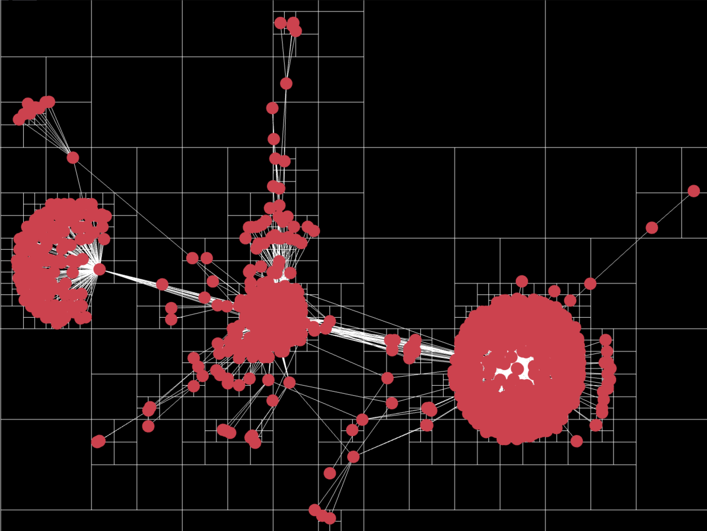

# Force directed graph



## Source (ish)
[Helper paper](https://www.researchgate.net/profile/Yifan-Hu-25/publication/235633159_Efficient_and_High_Quality_Force-Directed_Graph_Drawing/links/09e4151214090597a4000000/Efficient-and-High-Quality-Force-Directed-Graph-Drawing.pdf?origin=publication_detail&_tp=eyJjb250ZXh0Ijp7ImZpcnN0UGFnZSI6InB1YmxpY2F0aW9uIiwicGFnZSI6InB1YmxpY2F0aW9uRhttps://www.researchgate.net/profile/Yifan-Hu-25/publication/235633159_Efficient_and_High_Quality_Force-Directed_Graph_Drawing/links/09e4151214090597a4000000/Efficient-and-High-Quality-Force-Directed-Graph-Drawing.pdf?origin=publication_detail&_tp=eyJjb250ZXh0Ijp7ImZpcnN0UGFnZSI6InB1YmxpY2F0aW9uIiwicGFnZSI6InB1YmxpY2F0aWhttps://www.researchgate.net/profile/Yifan-Hu-25/publication/235633159_Efficient_and_High_Quality_Force-Directed_Graph_Drawing/links/09e4151214090597a4000000/Efficient-and-High-Quality-Force-Directed-Graph-Drawing.pdf?origin=publication_detail&_tp=eyJjb250ZXh0Ijp7ImZpcnN0UGFnZSI6InB1YmxpY2F0aW9uIiwicGFnZSI6InB1YmxpY2F0aW9uRG93bmxvYWQiLCJwcmV2aW91c1BhZ2UiOiJwdWJsahttps://www.researchgate.net/profile/Yifan-Hu-25/publication/235633159_Efficient_and_High_Quality_Force-Directed_Graph_Drawing/links/09e4151214090597a4000000/Efficient-and-High-Quality-Force-Directed-Graph-Drawing.pdf?origin=publication_detail&_tp=eyJjb250ZXh0Ijp7ImZpcnN0UGFnZSI6InB1YmxpY2F0aW9uIiwicGFnZSI6InB1YmxpY2F0aW9uRG93bmxvYWQiLCJwcmV2aW91c1BhZ2UiOiJwdWJsaWNhdGlvbiJ9fQ)

This project does not implement the optimal algorithm as described in the paper. It does however utilize a lot of the concepts, such as quadtrees.

## Dependencies
- Golang
- NodeJS

## Build
First, build the client
```
$ cd web && npm run build && cd ..
```
Second, run the server
```
$ go run main.go
```
Finally, open the site in your browser at `localhost:8080`
